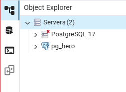
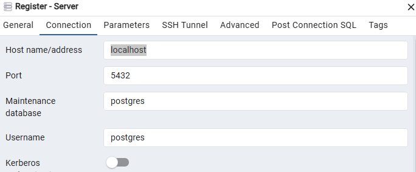

## SuperHero

The project was implemented according to the requirements, except for uploading and editing photos. A database was also created in PostgresSQL, but unfortunately I was unable to host it, so I wrote down all the detailed information on how to run (create) the project locally.

To set up the project, use these instructions for setting up the project locally:

1.Clone the repository:

```bash
git clone https://github.com/taniavozniuk/SuperHero.git

cd project-name(SuperHero)
```

2.Install dependencies:

```bash
npm install or yarn install
```

3.Run the project locally:

```bash
npm run dev or yarn run dev
```

To start the database you need:

1. Installing PostgreSQL

If PostgreSQL is not already installed:

Windows / Mac / Linux: download from the official [website](https://www.postgresql.org/download/)

During installation, remember:

Username (must be postgres)

Password (save it because you need to use it in the future)

Port (5432)

2. Creating a database.
   Open pgAdmin and enter the password (which you created during download) if need. Next, click in the left menu Default Workspace you will see the server. You must right-click on Server and select "Register -> Server". After that, I will show you a window where you need to enter the sevrer name  and click button Save.
   Next, go to Connection and write the host name 
   We open "pg_hero" and see Databases (this is the default), we create our own by right-clicking "Create -> Database" name "hero_bd";.
   Open our database, search for the branch "Schemas" and find the table, right-click We create a table "Create -> Table" name "SuperHero".And also the table "SuperHeroImage". Next, right-click on our created table and open View/Edit Data -> All Rows. There will be an empty command line. and there you will need to write.
   " SELECT \* FROM public."Superhero"
   ORDER BY id ASC "

3. Synchronizing the database with with the code(Prisma)

In the file ".env" change password to your own.
And write in the terminal

```bash
 "npx prisma migrate dev --name init".
```

This will create the table through Prisma, the code is already written, you just need to run the command.
After that, start the project if it is not running and in a separate terminal write the command

```bash
npx prisma studio
```

Open [http://localhost:3000](http://localhost:3000) with your browser to see the result.
